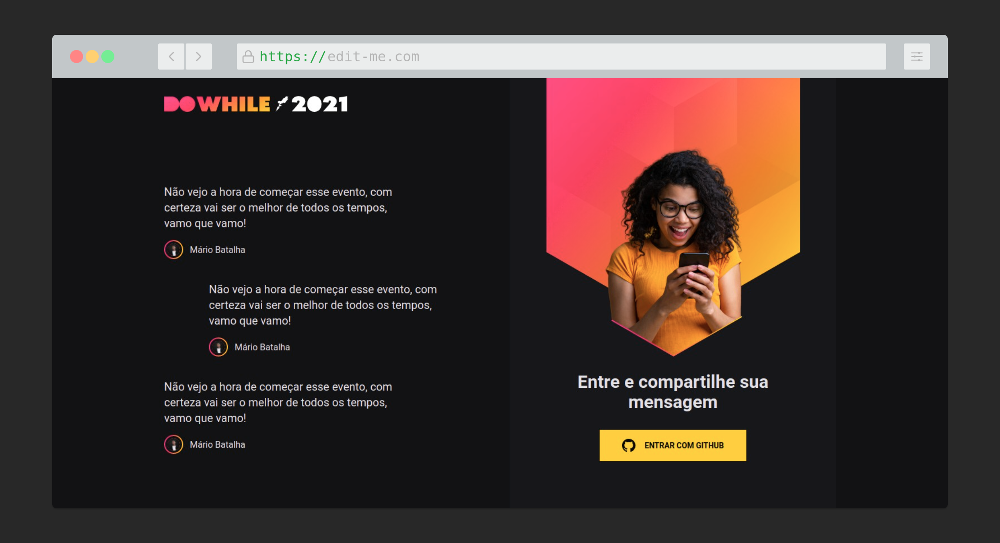

  

 

<h1 align="center">NLW Heat</h1>

Front-end web da nossa aplicação utilizando ReactJS. Além disso, criaremos nosso projeto utilizando o Vite, uma ferramenta extremamente performática, TypeScript e CSS modules. Vamos construir toda interface da aplicação do zero com Flexbox e Grid System, além de criar animações utilizando Framer Motion.

<h1 align="center">
  
</h1>

## Summary

  - [Begin](#Begin)
  - [Requirement](#Requirement)
  - [Installation](#Installation)
  - [Test](#Test)
  - [Deploy](#Deploy)
  - [Author](#Author)
  - [UI Based](#UI-Based)
  - [Useful technologies](#Useful-technologies)

## Begin

Follow the instructions below to run the app.

## Requirements

What do  you need to run.

* **[Node v>=13.8.0](https://nodejs.org/en/)** - Install Node JS in your machine.

### Installation

- Install all the dependencies.

Execute

    npm install

Or

    yarn install

- Start the project.
 
    npm start

Or

    yarn start

## Test

Executes the test

    npm run test

## Deploy

 - Netlify
## Author

  - **Mário Batalha** 

## UI-Based
  * **[Dribble](https://dribbble.com/shots/16274732-Vaccining-Vaccine-Landing-Page)** - Vaccining     

## Technologies
  - TS
  - HTML5
  - CSS Modules
  - React (Vite)
  - React-icons
  - React Router
  - Socket Client